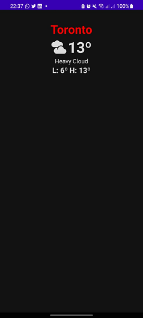
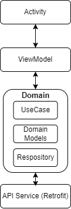

# Metaweather
<p align="center">This demonstrates modern Android development with Hilt, Coroutines, Flow, Jetpack, ViewModel, and Material Design based on MVVM architecture.</p>

## Screenshots



## Getting started

There are a few ways to open this project.

### Android Studio

1. `Android Studio` -> `File` -> `New` -> `From Version control` -> `Git`
2. Enter `https://github.com/GGarciaDev/Metaweather.git` into URL field an press `Clone` button

### Command-line + Android Studio

1. Run `git clone https://github.com/GGarciaDev/Metaweather.git` command to clone project
2. Open `Android Studio` and select `File | Open...` from the menu. Select cloned directory and press `Open` button

## Architecture

This app is based on the MVVM architecture and the Repository pattern



There is also a demonstration of the domain layer, which is the core layer of the application, this allows to make domain models and business logic independent from other layers.

## Inspiration

This is project is a "Take Home Project", it was inspired by other projects such as:

### Android projects
- [Sunflower](https://github.com/android/sunflower) - A gardening app illustrating Android development best practices with Android Jetpack.

## Trade Offs

I've tried following the 3 hours deadline, it was a close call for finishing the app so I didn't went too hard on tests, just a simple use case scenario but with hilt injection structure for testing with the viewmodel.

## Project Structure
```bash
MetaweatherApplication.kt
├──api
|  └──MetaweatherService.kt
├──data
|  ├──dto
|  |  ConsolidatedWeather.kt
|  |  Location.kt
|  |  Parent.kt
|  |  Source.kt
|  └──repository
|     LocationRepositoryImplementation.kt     
├──di
|  NetworkModule.kt
|  RepositoriesModule.kt
├──domain
|   ├──model
|   |  DisplayData.kt
|   ├──repository
|   |  LocationRepository.kt
|   └──use_case
|      DisplayGetUseCase.kt  
├──presentation
|   LocationItem.kt
|   LocationScreen.kt
|   LocationViewModel.kt
|   MainActivity.kt
├──ui
|  ├──theme
|     Color.kt
|     Shape.kt
|     Theme.kt
|     Type.kt
└──utilities
   Events.kt
   LocationStateList.kt
```
